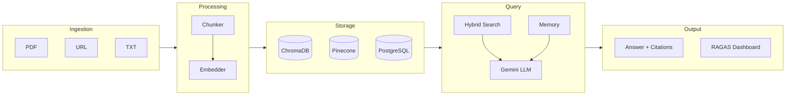
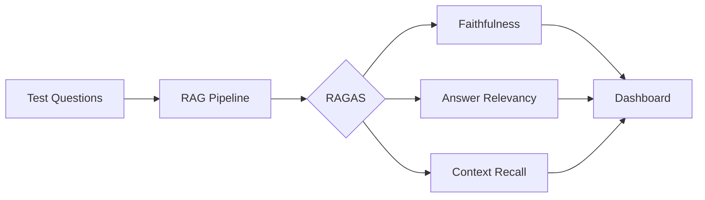

# ⚡ GalvanR.A.G

<div align="center">


<a href="https://galvanrag.vercel.app/">
  
</a>

**Self-hostable RAG pipeline. Upload docs. Get cited answers. Measure quality.**

[Quickstart](#quickstart) · [API Docs](#api) · [Evaluation](#evaluation) · [Roadmap](#roadmap)

</div>

---

## What is GalvanR.A.G?

GalvanR.A.G is a production-grade **Retrieval-Augmented Generation (RAG)** engine you can self-host.  
Upload PDFs, URLs, or text files → query them in natural language → get answers backed by source citations.

The differentiator: a built-in **RAGAS evaluation dashboard** that scores your pipeline on faithfulness, relevancy, and context recall — something almost no fresher portfolio has.

---

## Stack

| Layer | Technology |
|---|---|
| API | FastAPI |
| Orchestration | LangChain / LlamaIndex |
| LLM | Gemini 1.5 Flash (pluggable) |
| Vector Store | ChromaDB (local) + Pinecone (cloud) |
| Metadata DB | PostgreSQL |
| Embeddings | Sentence Transformers |
| Evaluation | RAGAS |
| Demo UI | Streamlit |
| Infra | Docker + GitHub Actions |

---

## Architecture



---

## Key Features

- **Hybrid Search** — vector similarity + BM25 keyword fusion, the way real production RAG works
- **Multi-turn Memory** — stateful conversation across queries per session
- **Dual Vector Store** — ChromaDB for local dev, Pinecone for cloud scale
- **Pluggable LLM** — swap Gemini ↔ OpenAI with one config change
- **RAGAS Evaluation** — automated scoring on faithfulness, answer relevancy, context recall
- **Source Citations** — every answer references the exact chunk it came from

---

## Quickstart

```bash
# Clone and configure
git clone https://github.com/Ashutosh3021/galvanprime
cd galvanprime
cp .env.example .env  # add your GEMINI_API_KEY, PINECONE_API_KEY

# Run with Docker
docker-compose up --build

# API available at http://localhost:8000
# Streamlit UI at http://localhost:8501
# Docs at http://localhost:8000/docs
```

---

## API

### Ingest a document

```bash
POST /ingest
Content-Type: multipart/form-data

file=@paper.pdf
chunk_strategy=semantic   # or "fixed"
collection=my-docs
```

### Query

```bash
POST /query
{
  "question": "What are the main findings?",
  "collection": "my-docs",
  "session_id": "abc123"
}
```

**Response:**
```json
{
  "answer": "The main findings include...",
  "citations": [
    { "source": "paper.pdf", "page": 4, "chunk": "...relevant excerpt..." }
  ],
  "session_id": "abc123"
}
```

---

## Evaluation

RAGAS runs automatically against a test question set and logs scores to PostgreSQL.  
View the live dashboard at `http://localhost:8501/eval`.



| Metric | Target |
|---|---|
| Faithfulness | > 0.80 |
| Answer Relevancy | > 0.75 |
| Context Recall | > 0.70 |

---

## Roadmap

- [x] Document ingestion (PDF / URL / TXT)
- [x] Fixed + semantic chunking
- [x] ChromaDB + Pinecone dual store
- [x] Hybrid search (vector + BM25)
- [x] Query API with citations
- [x] Multi-turn conversation memory
- [x] RAGAS eval suite + dashboard
- [x] Pluggable LLM backend
- [x] Docker + CI/CD

---

## Project Structure

```
galvanprime/
├── api/          # FastAPI routes (ingest, query, eval)
├── core/         # Ingestion, embeddings, retrieval, generation, evaluation
├── db/           # PostgreSQL models + migrations
├── ui/           # Streamlit demo
├── tests/
├── docker-compose.yml
└── .github/workflows/ci.yml
```

---

<div align="center">

Built by [Ashutosh Patra](https://github.com/Ashutosh3021) · AI/ML Track · B.Tech CSE (AI/ML)

</div>