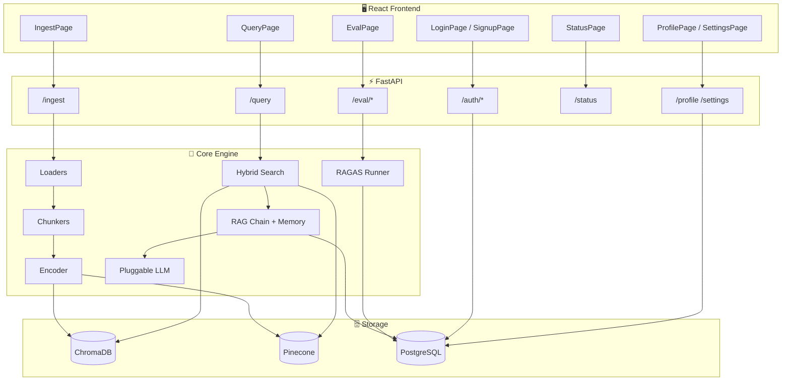
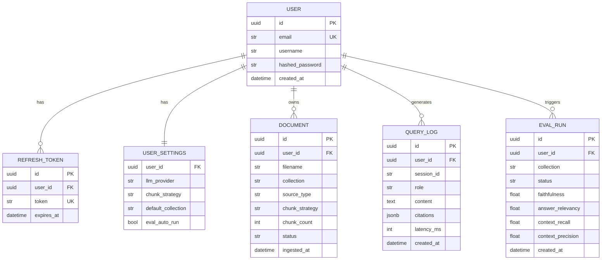
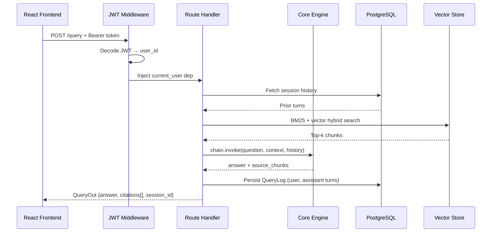
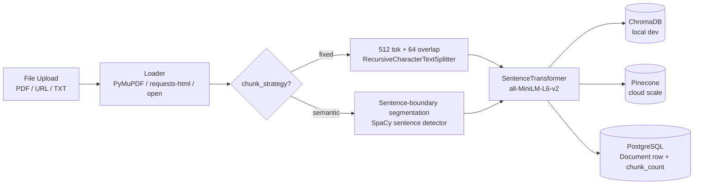
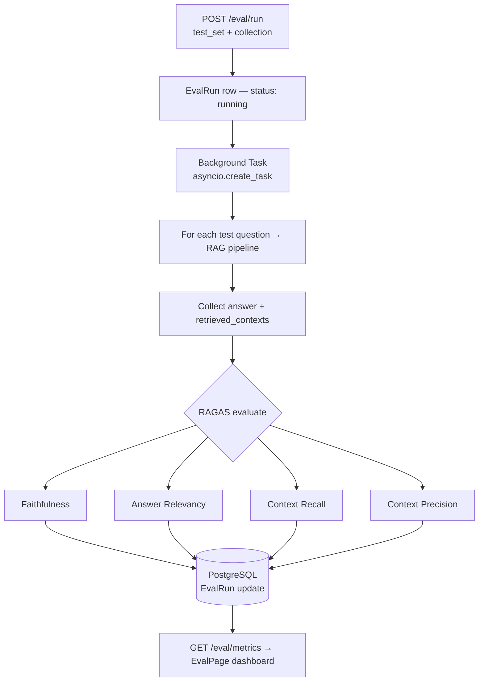
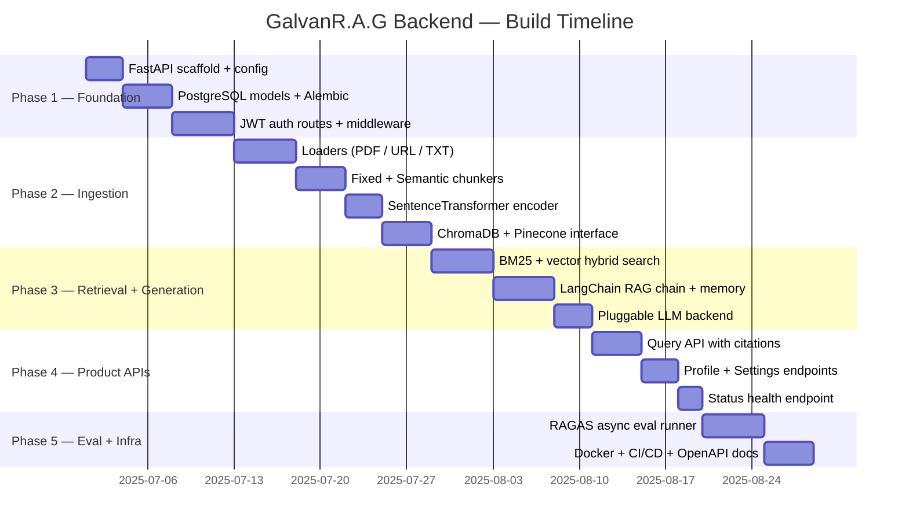

# GalvanR.A.G — Backend Build Plan

## Overview

FastAPI backend powering the GalvanR.A.G RAG engine.  
Serves the React frontend (auth, ingestion, query, eval, profile, settings, status).  
Target: production-grade, fully containerised, ready to deploy.

---

## Backend Directory Structure

```
backend/
├── main.py                        # FastAPI app + lifespan + router mount
├── config.py                      # Pydantic Settings — reads .env
├── requirements.txt
├── Dockerfile
├── .env.example
│
├── api/
│   ├── deps.py                    # Shared FastAPI dependencies
│   ├── middleware/
│   │   ├── auth.py                # JWT bearer extraction
│   │   └── cors.py                # CORS config for Vite dev + prod
│   └── routes/
│       ├── auth.py                # POST /auth/register, /login, /refresh, /logout
│       ├── ingest.py              # POST /ingest, GET /ingest/collections, DELETE /ingest/{doc_id}
│       ├── query.py               # POST /query, GET /query/history/{session_id}
│       ├── eval.py                # POST /eval/run, GET /eval/metrics, GET /eval/history
│       ├── status.py              # GET /status
│       ├── profile.py             # GET /profile/me, PUT /profile/me
│       └── settings.py            # GET /settings, PUT /settings
│
├── core/
│   ├── ingestion/
│   │   ├── loaders.py             # PDF (PyMuPDF), URL (BeautifulSoup), TXT parsers
│   │   └── chunkers.py            # FixedChunker, SemanticChunker
│   ├── embeddings/
│   │   └── encoder.py             # SentenceTransformer wrapper — singleton
│   ├── retrieval/
│   │   ├── vectorstore.py         # ChromaDB + Pinecone unified interface
│   │   └── hybrid.py              # BM25 + vector score fusion (RRF)
│   ├── generation/
│   │   ├── chain.py               # LangChain RAG chain assembly
│   │   ├── memory.py              # ConversationBufferMemory per session_id
│   │   └── llm.py                 # Pluggable LLM — Gemini / OpenAI toggle
│   └── evaluation/
│       ├── ragas_runner.py        # RAGAS async evaluation runner
│       └── metrics.py             # Faithfulness, Answer Relevancy, Context Recall/Precision
│
├── db/
│   ├── base.py                    # SQLAlchemy declarative base
│   ├── session.py                 # Async session factory
│   ├── models/
│   │   ├── user.py                # User, RefreshToken
│   │   ├── document.py            # Document, Chunk
│   │   ├── query_log.py           # QueryLog
│   │   └── eval_result.py         # EvalRun, EvalMetric
│   └── migrations/                # Alembic env + versions
│
└── schemas/
    ├── auth.py                    # RegisterIn, LoginIn, TokenOut
    ├── ingest.py                  # IngestIn, IngestOut, CollectionOut
    ├── query.py                   # QueryIn, QueryOut, Citation, HistoryOut
    ├── eval.py                    # EvalRunIn, EvalRunOut, MetricOut
    ├── profile.py                 # ProfileOut, ProfileUpdateIn
    └── settings.py                # SettingsOut, SettingsUpdateIn
```

---

## Architecture



---

## API Contract

> All protected endpoints require `Authorization: Bearer <access_token>`.

### Auth — `/auth`

| Method | Path | Body | Response | Frontend consumer |
|--------|------|------|----------|-------------------|
| POST | `/auth/register` | `RegisterIn` | `TokenOut` | SignupPage |
| POST | `/auth/login` | `LoginIn` | `TokenOut` | LoginPage |
| POST | `/auth/refresh` | `{ refresh_token }` | `TokenOut` | all pages (silent refresh) |
| POST | `/auth/logout` | — | `204` | SettingsPage |

```python
# schemas/auth.py
class RegisterIn(BaseModel):
    email: EmailStr
    username: str
    password: str          # min 8 chars, validated server-side

class LoginIn(BaseModel):
    email: EmailStr
    password: str

class TokenOut(BaseModel):
    access_token: str      # JWT, 30m TTL
    refresh_token: str     # opaque, 7d, stored in PostgreSQL
    token_type: str = "bearer"
    user: UserOut
```

---

### Ingest — `/ingest`

| Method | Path | Body | Response | Frontend consumer |
|--------|------|------|----------|-------------------|
| POST | `/ingest` | `multipart/form-data` | `IngestOut` | IngestPage (MobileIngest) |
| GET | `/ingest/collections` | — | `list[CollectionOut]` | QueryPage (collection selector) |
| DELETE | `/ingest/{doc_id}` | — | `204` | IngestPage |

```python
# schemas/ingest.py
class IngestOut(BaseModel):
    doc_id: str
    filename: str
    collection: str
    chunk_count: int
    chunk_strategy: Literal["fixed", "semantic"]
    status: Literal["processing", "ready", "failed"]
    ingested_at: datetime

class CollectionOut(BaseModel):
    name: str
    doc_count: int
    chunk_count: int
    created_at: datetime
```

Form fields: `file` (PDF/TXT), `url` (optional), `chunk_strategy` (`fixed` | `semantic`), `collection` (str).

---

### Query — `/query`

| Method | Path | Body | Response | Frontend consumer |
|--------|------|------|----------|-------------------|
| POST | `/query` | `QueryIn` | `QueryOut` | QueryPage |
| GET | `/query/history/{session_id}` | — | `list[HistoryOut]` | QueryPage (chat history) |

```python
# schemas/query.py
class QueryIn(BaseModel):
    question: str
    collection: str
    session_id: str        # UUID; frontend generates on new chat

class Citation(BaseModel):
    source: str            # filename or URL
    page: int | None
    chunk: str             # excerpt text

class QueryOut(BaseModel):
    answer: str
    citations: list[Citation]
    session_id: str
    latency_ms: int

class HistoryOut(BaseModel):
    role: Literal["user", "assistant"]
    content: str
    citations: list[Citation] | None
    created_at: datetime
```

---

### Eval — `/eval`

| Method | Path | Body | Response | Frontend consumer |
|--------|------|------|----------|-------------------|
| POST | `/eval/run` | `EvalRunIn` | `EvalRunOut` | EvalPage (run button) |
| GET | `/eval/metrics` | `?run_id=` | `list[MetricOut]` | EvalPage (dashboard) |
| GET | `/eval/history` | — | `list[EvalRunOut]` | EvalPage (run history) |

```python
# schemas/eval.py
class EvalRunIn(BaseModel):
    collection: str
    test_set: list[dict]   # [{ "question": "...", "ground_truth": "..." }]

class EvalRunOut(BaseModel):
    run_id: str
    collection: str
    status: Literal["running", "complete", "failed"]
    faithfulness: float | None
    answer_relevancy: float | None
    context_recall: float | None
    context_precision: float | None
    created_at: datetime

class MetricOut(BaseModel):
    metric: str
    score: float
    target: float
    passed: bool
```

---

### Status — `/status`

| Method | Path | Response | Frontend consumer |
|--------|------|----------|-------------------|
| GET | `/status` | `StatusOut` | StatusPage |

```python
class ServiceStatus(BaseModel):
    name: str
    status: Literal["healthy", "degraded", "down"]
    latency_ms: int | None

class StatusOut(BaseModel):
    api: Literal["healthy", "degraded"]
    services: list[ServiceStatus]   # postgres, chroma, pinecone, llm
    uptime_seconds: int
    version: str
```

---

### Profile & Settings — `/profile`, `/settings`

| Method | Path | Body | Response | Frontend consumer |
|--------|------|------|----------|-------------------|
| GET | `/profile/me` | — | `ProfileOut` | ProfilePage |
| PUT | `/profile/me` | `ProfileUpdateIn` | `ProfileOut` | ProfilePage |
| GET | `/settings` | — | `SettingsOut` | SettingsPage |
| PUT | `/settings` | `SettingsUpdateIn` | `SettingsOut` | SettingsPage |

```python
# schemas/profile.py
class ProfileOut(BaseModel):
    id: str
    username: str
    email: EmailStr
    created_at: datetime
    doc_count: int
    query_count: int

# schemas/settings.py
class SettingsOut(BaseModel):
    llm_provider: Literal["gemini", "openai"]
    chunk_strategy: Literal["fixed", "semantic"]
    default_collection: str | None
    eval_auto_run: bool
```

---

## Database Models



---

## Request Lifecycle



---

## Ingestion Flow



---

## Evaluation Pipeline



---

## Phase Breakdown



---

## Phase Feature Map

| Phase | Deliverable | Key files | Unlocks frontend page |
|-------|-------------|-----------|----------------------|
| 1 | Auth system | `routes/auth.py`, `models/user.py`, `middleware/auth.py` | LoginPage, SignupPage |
| 2 | Ingestion pipeline | `core/ingestion/`, `core/embeddings/`, `routes/ingest.py` | IngestPage |
| 3 | Retrieval + generation | `core/retrieval/`, `core/generation/` | — |
| 4 | Query API | `routes/query.py`, `models/query_log.py` | QueryPage |
| 5 | Profile + Settings | `routes/profile.py`, `routes/settings.py` | ProfilePage, SettingsPage |
| 6 | Status endpoint | `routes/status.py` | StatusPage |
| 7 | RAGAS eval | `core/evaluation/`, `routes/eval.py`, `models/eval_result.py` | EvalPage |
| 8 | Docker + CI/CD | `Dockerfile`, `docker-compose.yml`, `.github/workflows/` | deployment |

---

## CORS Configuration

```python
# api/middleware/cors.py
origins = [
    "http://localhost:5173",       # Vite dev server
    "https://galvanrag.vercel.app" # Production frontend
]
```

---

## Environment Variables

```env
# LLM
GEMINI_API_KEY=
OPENAI_API_KEY=            # optional fallback

# Vector Stores
PINECONE_API_KEY=
PINECONE_ENVIRONMENT=
CHROMA_PERSIST_DIR=./chroma_db

# Database
DATABASE_URL=postgresql+asyncpg://user:pass@db:5432/galvanprime

# Auth
SECRET_KEY=                # 32-byte random string
ACCESS_TOKEN_EXPIRE_MINUTES=30
REFRESH_TOKEN_EXPIRE_DAYS=7

# App
ENVIRONMENT=development    # or production
LOG_LEVEL=INFO
```

---

## Success Metrics

- [ ] `POST /auth/login` returns JWT in < 200ms
- [ ] 100-page PDF ingested and queryable in < 30s
- [ ] `POST /query` P95 latency < 3s
- [ ] RAGAS faithfulness > 0.80 on default test set
- [ ] All endpoints documented at `/docs` (OpenAPI)
- [ ] One-command start: `docker-compose up`
- [ ] CI passes on every push to `main`